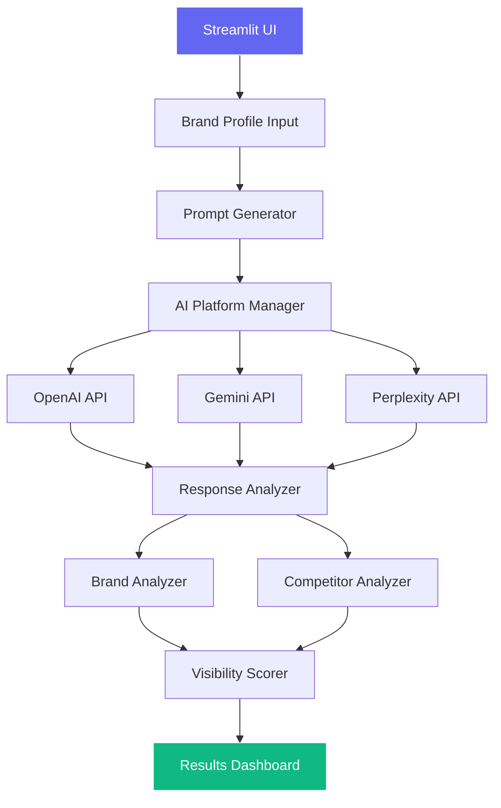

# 👁️ BrandwatchAI

<div align="center">


[](https://www.python.org)
[](https://streamlit.io)
[](https://openai.com)
[](https://ai.google.dev)
[](LICENSE)

**🚀 Track and analyze your brand's presence across major AI platforms in real-time**

[Demo](#-demo) • [Features](#-features) • [Installation](#-installation) • [Usage](#-usage) • [Architecture](#-architecture) • [Contributing](#-contributing)

</div>

---

## 🎯 Overview

BrandwatchAI is an intelligent Streamlit-powered application that monitors brand visibility across multiple AI platforms. Get actionable insights about how ChatGPT, Gemini, and Perplexity AI perceive and recommend your brand.

<div align="center">

</div>

## ✨ Features

<table>
<tr>
<td width="50%">

### 🤖 Multi-Platform AI Analysis
- **OpenAI ChatGPT** (GPT-4o)
- **Google Gemini** (2.5-flash)
- **Perplexity AI** (llama-3.1-sonar)

</td>
<td width="50%">

### ⚡ High-Performance Architecture
- Concurrent API calls (20+ simultaneous)
- 90% faster than sequential processing
- Results in 20-30 seconds

</td>
</tr>
<tr>
<td width="50%">

### 📊 Comprehensive Analytics
- Brand mention frequency tracking
- Sentiment analysis & context extraction
- Ranking position identification
- Competitor comparison

</td>
<td width="50%">

### 🎨 Professional UI/UX
- Modern SaaS-style interface
- Custom CSS with gradient effects
- Interactive Plotly visualizations
- Real-time progress tracking

</td>
</tr>
</table>

## 🚀 Quick Start

### Prerequisites

- Python 3.11+
- API Keys for:
  - OpenAI
  - Google Gemini
  - Perplexity

### Installation

1. **Clone the repository**
```bash
git clone https://github.com/yourusername/brandwatchai.git
cd brandwatchai
```

2. **Install dependencies**
```bash
# Using pip
pip install streamlit pandas plotly openai google-genai requests spacy

# Or using the project's pyproject.toml
pip install -e .
```

3. **Set up environment variables**
```bash
# Create .env file
touch .env

# Add your API keys
echo "OPENAI_API_KEY=your_openai_key" >> .env
echo "GEMINI_API_KEY=your_gemini_key" >> .env
echo "PERPLEXITY_API_KEY=your_perplexity_key" >> .env
```

4. **Run the application**
```bash
streamlit run app.py --server.port 5000
```

## 📖 Usage

### 1️⃣ Brand Profile Setup
<div align="center">

</div>

- Enter your brand name
- Select or type your industry
- Add up to 5 competitors
- Choose target location (optional)

### 2️⃣ Analysis Configuration
<div align="center">

</div>

- Adjust number of prompts (10-50)
- Select AI platforms to analyze
- Click "Start Analysis"

### 3️⃣ View Results
<div align="center">

</div>

Navigate through tabs:
- **Overview**: Key metrics and scores
- **Platform Analysis**: Detailed platform breakdown
- **Competitor Comparison**: Side-by-side analysis
- **Detailed Results**: Raw data and responses
- **Insights**: AI-generated recommendations

## 🏗️ Architecture



### Core Components

| Component | Description |
|-----------|-------------|
| **AIPlatformManager** | Unified API integration layer for all AI platforms |
| **PromptGenerator** | Industry-specific query generation engine |
| **BrandAnalyzer** | Extract and analyze brand mentions |
| **CompetitorAnalyzer** | Comparative market positioning analysis |
| **VisibilityScorer** | Weighted scoring algorithm |
| **NLPProcessor** | Natural language processing utilities |

## 📊 Performance Metrics

<div align="center">

| Metric | Sequential | **Concurrent** | Improvement |
|--------|------------|----------------|-------------|
| Analysis Time | 3-5 minutes | **20-30 seconds** | 🚀 90% faster |
| API Calls | 1 at a time | **20+ simultaneous** | ⚡ 20x throughput |
| Memory Usage | Standard | **Optimized** | 💾 Minimal footprint |

</div>

## 🎨 UI Showcase

### Platform-Specific Styling
<div align="center">


</div>

### Modern Dashboard Components
- 📊 Interactive Plotly charts
- 📈 Real-time progress indicators
- 🎯 Metric cards with hover effects
- 🌈 Gradient headers and shadows
- 📱 Responsive design

## 🛠️ Configuration

### Industry Templates

```python
# config/industries.py
INDUSTRIES = {
    "FinTech": {
        "terms": ["payment", "banking", "finance", "money transfer"],
        "use_cases": ["Send money", "Pay bills", "Investment"],
        # ... more configuration
    },
    # Add custom industries here
}
```

### Prompt Customization

```python
# Adjust prompt generation
prompt_generator = PromptGenerator()
prompts = prompt_generator.generate_prompts(
    industry="FinTech",
    count=30,
    location="United States"
)
```

## 🤝 Contributing

We love contributions! Please see our [Contributing Guidelines](CONTRIBUTING.md) for details.

```bash
# Fork the repo
# Create your feature branch
git checkout -b feature/AmazingFeature

# Commit your changes
git commit -m 'Add some AmazingFeature'

# Push to the branch
git push origin feature/AmazingFeature

# Open a Pull Request
```

## 📈 Roadmap

- [ ] Historical trend tracking
- [ ] Additional AI platforms (Claude, Bard)
- [ ] Export functionality (PDF/Excel)
- [ ] Multi-brand monitoring
- [ ] API endpoint for integration
- [ ] Scheduled automated reports

## 📄 License

This project is licensed under the MIT License - see the [LICENSE](LICENSE) file for details.

## 🙏 Acknowledgments

- Built with [Streamlit](https://streamlit.io)
- Powered by [OpenAI](https://openai.com), [Google Gemini](https://ai.google.dev), and [Perplexity](https://perplexity.ai)
- Icons by [Heroicons](https://heroicons.com)

---

<div align="center">

</div>
